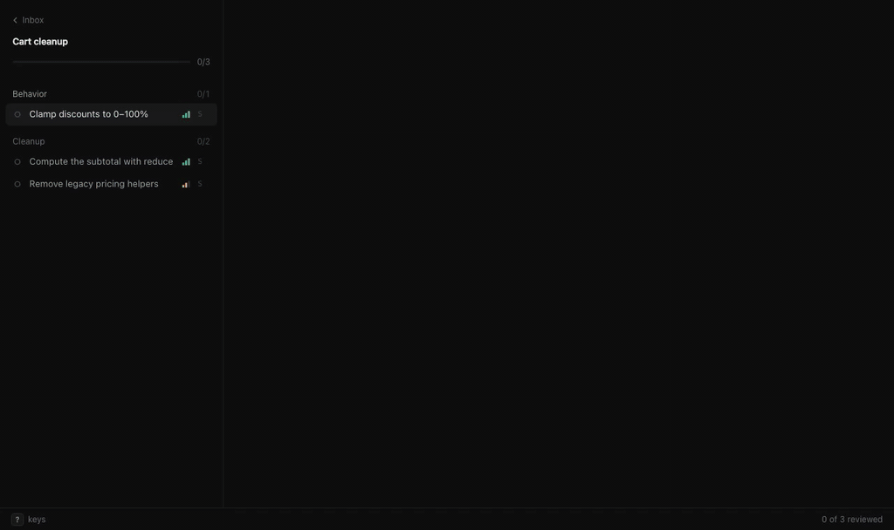

# docket

Review a batch of pull requests or local branches in the browser with Vim keys, then hand your verdicts back to the agent that asked.



docket reads diffs from your local git checkout (and PR metadata from `gh`). It never writes to GitHub.

## Install

Requires [Bun](https://bun.sh) 1.3+ and git; [`gh`](https://cli.github.com) for GitHub PRs.

```sh
bun install -g @kitlangton/docket
```

## Quick start

From a clone of this repo:

```sh
bun examples/demo.ts             # creates ./demo-repo with three branches and a manifest
docket demo-repo/docket.json     # opens http://docket.localhost:4789
```

Other ways to start a session, from inside a checkout:

```sh
docket 123 456                   # GitHub PR numbers, in this order
docket --author @me --state open # anything gh pr list can filter
docket my-branch                 # a local branch against the base it forked from
docket main..my-branch           # an explicit range
docket open                      # the inbox
docket server status|stop|restart
```

| Option          | Description                                   |
| --------------- | --------------------------------------------- |
| `--repo <path>` | Git checkout to use (default: current dir)    |
| `--out <path>`  | Where to write `verdicts.json`                |
| `--port <n>`    | Server port (default: `$DOCKET_PORT` or 4789) |
| `--no-open`     | Don't open a browser                          |
| `--refresh`     | Ignore the PR cache                           |

Move with `j`/`k`, comment with `c` (or `V` then `c` on lines), decide with `a`/`r`/`s`, and hand back with `w` on the summary. `?` lists every key.

## With an agent

1. The agent writes a manifest: the PRs in review order, each with a one-line reason.
2. It runs `docket manifest.json` in the background. The command prints a URL and blocks.
3. You review and hand back. docket writes `verdicts.json`, prints a summary and its path, and exits 0. Ctrl-C also exits 0 and leaves the session open in the inbox.
4. The agent reads `verdicts.json` and acts: merge approvals, close rejections, answer notes.

[`skill/SKILL.md`](skill/SKILL.md) is a ready-made instruction file for coding agents.

### Manifest

```json
{
  "title": "Cart cleanup",
  "summary": "Optional context for the batch.",
  "repo": { "path": ".", "github": "owner/repo" },
  "groups": [
    {
      "title": "Behavior",
      "why": "Optional; shown under the group in the summary and on hover.",
      "prs": [
        { "number": 101, "why": "What it does, and the evidence that it is right.", "confidence": "high" },
        {
          "number": 102,
          "why": "…",
          "after": [101],
          "focus": ["src/cart.ts"],
          "confidence": "medium",
          "risk": "What could go wrong."
        },
        { "ref": "main..my-branch", "why": "Local work that isn't on GitHub." }
      ]
    }
  ]
}
```

- `repo.path` is relative to the manifest. `repo.github` defaults to the `origin` remote; it is only needed for `number` items.
- `after`: PRs this one stacks on. `focus`: files listed first.
- `confidence`: `high`, `medium`, or `low`. docket adds a size from the diff: **S** ≤ 50 lines and ≤ 3 files, **L** > 400 lines or > 15 files, otherwise **M**.
- Descriptions, `why`, and `risk` are Markdown.

### verdicts.json

```json
{
  "session": "/abs/path/docket.json",
  "reviewedAt": "2026-10-03T20:15:00.000Z",
  "prs": [
    {
      "number": 102,
      "title": "fix(cart): clamp discounts",
      "confidence": "medium",
      "size": "S",
      "verdict": "reject",
      "reason": "Depends on #101",
      "reviewedHead": "4f1c…",
      "currentHead": "4f1c…",
      "notes": [
        { "body": "Is 100% still valid?" },
        { "path": "src/cart.ts", "side": "RIGHT", "line": 14, "body": "Clamp here?" },
        { "path": "src/cart.ts", "side": "RIGHT", "startLine": 10, "line": 14, "body": "This block" }
      ]
    }
  ]
}
```

Every item appears in manifest order, with `number` or `ref`. `verdict` is `approve`, `reject`, `skip`, or `null`. A note without `path` is about the whole PR. Line notes use GitHub's review-comment convention: `RIGHT` is the head's line numbers, `LEFT` the base's, and `startLine` appears only for ranges. `reviewedHead` differing from `currentHead` means commits landed after the verdict.

## Keys

Generated from `web/keymap.ts`, which also drives key handling and the `?` overlay.

<!-- keys:start -->
| Keys | Action |
| --- | --- |
| **Navigate** | |
| `j` / `]c` / `}` | Next change (count) |
| `k` / `[c` / `{` | Previous change; from the first, the PR header (count) |
| `Ctrl-n` | Next line (count) |
| `Ctrl-p` | Previous line (count) |
| `]` | Next file (count) |
| `[` | Previous file (count) |
| `]u` | Next unviewed file; at the end, the next unreviewed PR |
| `[u` | Previous unviewed file |
| `J` | Next PR (count) |
| `K` | Previous PR (count) |
| `gg` | Top of PR |
| `G` | Bottom of PR; with a count, that line of the current file (count) |
| `Ctrl-d` | Half page down (count) |
| `Ctrl-u` | Half page up (count) |
| `Ctrl-f` | Page down (count) |
| `Ctrl-b` | Page up (count) |
| `Ctrl-e` | Scroll one line down (count) |
| `Ctrl-y` | Scroll one line up (count) |
| `zz` | Cursor line to center |
| `zt` | Cursor line to top |
| `zb` | Cursor line to bottom |
| `Ctrl-o` | Jump back (count) |
| `Ctrl-i` / `Tab` | Jump forward (count) |
| **Review** | |
| `a` | Approve, then next |
| `r` | Reject with a reason |
| `s` | Skip, then next |
| `u` | Undo verdict change |
| `Ctrl-r` | Redo verdict change |
| `c` | Comment on the PR |
| `C` | Comment on the PR (also in visual mode) |
| `V` / `v` | Select lines (visual mode) |
| `j` / `Ctrl-n` / `ArrowDown` | Extend selection down _(visual)_ |
| `k` / `Ctrl-p` / `ArrowUp` | Extend selection up _(visual)_ |
| `c` / `Enter` | Comment on the selected lines _(visual)_ |
| `e` / `Enter` | Edit the focused PR note _(note)_ |
| `d` | Delete the focused PR note _(note)_ |
| `x` | Mark file viewed |
| `i` | Toggle changes since your review |
| **Folds** | |
| `za` / `o` | Toggle fold |
| `zo` | Open fold |
| `zc` | Close fold |
| `zR` | Open all folds |
| `zM` | Fold all files |
| `e` | Expand 20 lines of context around the change |
| `E` | Expand all context around the change |
| **Commands** | |
| `:` | Command line (:w :q :wq :s :<PR number> :set wrap) |
| `Enter` | Summary (unfolds a folded file first) |
| `ZZ` | Hand back and close |
| `f` | Jump to file |
| `T` | File tree |
| `Enter` / `o` / `l` | Open file or folder _(tree)_ |
| `h` | Close folder _(tree)_ |
| `Escape` | Back to the diff _(tree)_ |
| `t` | Split / unified |
| `zw` | Ignore whitespace |
| `O` | Open on GitHub |
| `?` | Toggle this help |
| `Escape` | Cancel pending key or selection |
| `w` | Hand back _(summary)_ |
| **Inbox** | |
| `gh` | Go to the inbox |
| `j` / `ArrowDown` | Next session _(home)_ |
| `k` / `ArrowUp` | Previous session _(home)_ |
| `Enter` / `o` | Open session _(home)_ |
| `d` | Archive a session that isn't waiting _(home)_ |
<!-- keys:end -->

Sequences (`gg`, `]c`, `zz`) are typed in order; a bare `]` or `[` runs after about 400 ms. "(count)" bindings take a count, like `3j` or `2]`; `10G` goes to line 10 of the current file.

`:` commands: `:w`/`:wq`/`ZZ` hand back, `:q` closes without handing back (`:q!` skips the confirmation), `:s` opens the summary, `:52987` or `:3` jumps to a PR, and `:set wrap`/`:set nowrap` toggle wrapping.

## How it works

- **One server.** Sessions live in a single background server at `http://docket.localhost:4789`, bound to 127.0.0.1 (browsers resolve `*.localhost` locally). `docket <args>` starts it if needed, registers the session, opens its tab (or reuses an open docket tab), and waits on the session's event stream. Registering the same session again attaches to it.
- **Inbox.** `/` lists sessions waiting on you, in progress, and done.
- **Upgrades.** The server reports a version built from the package version and a hash of the source. A client running different code restarts it; open tabs save, reload, and reconnect.
- **Idle.** The server exits after 30 minutes with no open tabs and no waiting clients (`DOCKET_IDLE_MS`).
- **Data.** Session state and verdicts live next to a manifest, or in `~/.local/share/docket/<slug>/` for ad-hoc sessions. GitHub PR data is cached in `~/.cache/docket`. The server log is `~/.local/share/docket/.server/server.log`.
- **portless.** If [`portless`](https://github.com/vercel-labs/portless) is on `PATH`, the server also registers `https://docket.localhost`.
- **Diffs.** PRs are diffed against their merge base with local git (fetching `pull/N/head` once), falling back to `gh pr diff`. Expanding context reads full files with `git show`. Sessions open in a tab refresh every minute; PRs with new commits since your verdict are marked, and `i` shows only what changed.

## Development

```sh
bun install
bun run typecheck   # tsc and the README key table
bun run test        # unit tests
bunx playwright install chromium
bun run e2e         # end-to-end tests against throwaway git repos
bun run keys        # regenerate the README key table
```

The end-to-end tests run each case on its own port with temporary data and cache directories, so they don't touch a running docket.

Releases publish to npm from CI on a version tag, using npm trusted publishing:

```sh
npm version patch && git push --follow-tags
```

## Credits

Diffs are rendered with [`@pierre/diffs`](https://diffs.com) (Apache-2.0). The UI uses the [Geist](https://vercel.com/font) fonts (SIL Open Font License 1.1; see `web/fonts/LICENSE-Geist.txt`).

## License

MIT
